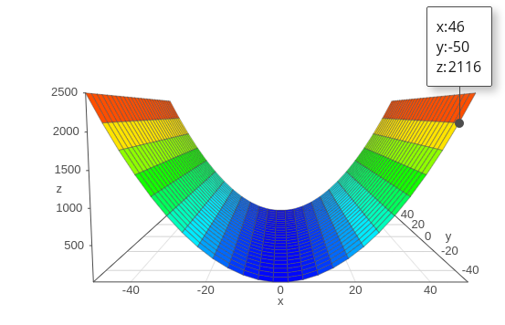
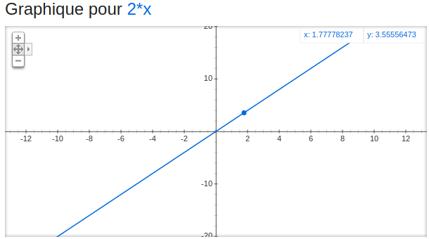
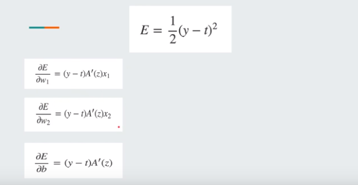

# Descente de gradient

> La dérivée traduit l'allure d'une fonction. Ici un exemple de la dérivée de $f(x) = x^2$

> Le gradient est la *valeur* de la dérivée d'une fonction en un point donné.

$f(x) = x^2$

$f'(x) = 2x$

> Donc si je rentre 5 dans $f(x) = x^2$ le gradient sera $f'(5) = 10$.
> On le voit le gradient va dans le sens de l'allure de la fonction (Ici la dérivée est négative puis positive, tout comme la fonction est décroissante puis croissante) or nous voulons minimiser cette fonction.
> Nous allons donc prendre l'inverse du gradient pour minimiser les valeurs de sortie de la fonction et nous allons multiplier par un learning rate pour descendre petit à petit.

# Fonction de plusieurs variables

> Dans le cas d'une fonction ou d'un modèle à plusieurs entrées on utilise simplement la dérivée partielle de la fonction à minimiser, par rapport à chaque variables que l'on souhaite mettre à jour et qui joue un rôle dans le résultat de cette fonction.
> (Dans notre cas ce sera la fonction d'erreur qui dépend des poids de la fonction du modèle)

> Et donc pour minimiser la fonction d'erreur entière on va modifier la valeur de chaque poids du modèle, et cela grace aux gradients des dérivées partielles par rapport a chaque poids:  
> *$w_i = w_i - (a * grad_i * w_i )$*

> Il nous faudra donc tous les gradients de la fonction (la fonction d'erreur) par rapport à chaque poids du modèle.
> Une fois qu'on a mis à jour tous les poids de la fonction d'erreur elle sera minimisée.

 # Important 

> il est IMPORTANT de noter qu'ici la dérivée partielle sera la dérivée partielle de la fonction d'erreur (et non la fonction du modèle) par rapport à chaque poids. 

> On parle d'une fonction à plusieurs variables ici, car la fonction de loss dépend de la fonction du modèle et donc on utilise la chain rule pour avoir les gradients de la fonction de loss par rapport aux poids de la fonction du modèle

> On souhaite donc minimiser la fonction de loss qui dépend de la fonction du modèle, qui dépend lui même des poids.

# loss -> model -> weight

> La chain rule permet de remonter le graphe du modèle et de modifier tout ce qui fait varier la valeur de la loss (en l'occurence ici les poids et le biais) 
