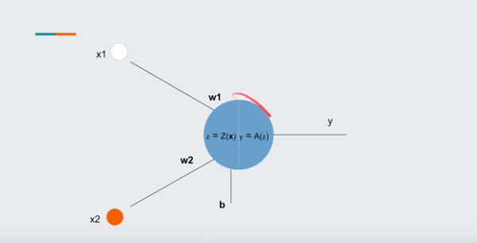
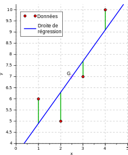
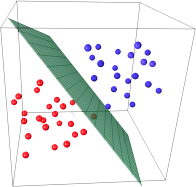

# Neurone

Un neurone représente la fonction que l'on souhaite ajuster.
Il prend en entrée plusieurs inputs (variable) et chaque input possède un poids "W" associé.
C'est en faisant varier ce poids que l'on fait varier la prédiction.
Le poids permet de donner de l'importance ou non a une variable d'input.
Et joue également un rôle de coefficient directeur.

Le dernier poids est le biais $b$ c'est l'ordonnée a l'origine de la droite ou le plan ... représentant le modèle.

Dans un neurone il y a 2 opérations :
* La pré-activation qui est le résultat de la fonction dans le neurone (somme pondéré avec les inputs les poids et le biais) $z(x) = \sum_{i}^{N}(w_i,x_i) + b$
* L'activation, le fais de transformer la sortie de la fonction qui tend vers $+\infty$ et $-\infty$ pour différent usage. Par example la fonction sigmoide pour réduire entre 0 et 1 et donc avoir une prédiction binaire

## Important :

Sachant que l'on connait la valeur attendue. Le but du modèle est de s'ajuster pour faire passer la droite ou le plan ... par la valeur attendue réelle.

La valeur de retour de la fonction présente dans le neurone représente donc la prédiction tandis que l'on connait les valeurs attendues de cette prédiction.

En prenant les valeurs attendues et les inputs on est capable de former un "scatter plot"

La fonction du modèle avec ses poids ajustés représentera une droite ou un plan, positionné de manière a réduire le plus possible la distance entre les valeurs attendue et les prédictions.

Si je prends x, y la sortie z sera sur le plan de prédiction et le plus proche possible de la valeur réelle.

Si je prends x la sortie y sera sur la droite de prédiction et le plus proche possible de la valeur réelle.

La prédiction représente la coordonée n + 1 soit la cordonnée des valeurs attendues.
Avec 2 entrées c'est $z$ avec 1 entré c'est $y$ qui est recherché

# Voir 3D Surface Plotter and Playground tensorflow
