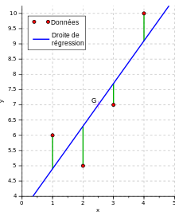
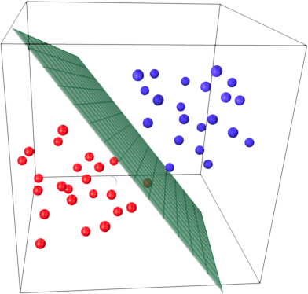

 # Régression Linéaire

> La régression linéaire est une modélisation linéaire qui permet d'établir des estimations dans le futur à partir d'informations provenant du passé. Cet outil est utilisé pour les analyses techniques boursières mais aussi pour la gestion de budgets. Elle est souvent calculée avec la méthode des moindres carrés qui permet de réduire les erreurs en ajoutant de l'information.

 * Dans le cas d'une régression linéaire le modèle nous donne une prédiction de $y$ . $f(x) = y$. On donne une entrée $x$ (la superficie d'une maison par exemple) et on attend en $y$ (prédiction) le prix de la maison.

 * Imaginons que notre maison fasse 100 m² et que son prix soit de 250 010 euros.
 Si l'on passe 100 dans $f(x) = ax + b$
et que la fonction nous retourne 200 000
il y a une erreur de 50 010, on ajuste donc le paramètre $a$ de la fonction pour qu'elle nous retourne exactement 250 010.

* On cherche donc a avoir $f(x) = 250x + 10$ et que le résultat soit égale à 250 010. Si on trouve le $a$ optimal. À chaque fois que l'on rentrera  100m² le modèle resortira 250 010 euros.
$f(100) = 250 * 100 + 10$ -> 250 010

 * Dans ce cas le modèle représente une droite, car l'équation est une équation linéaire de type $f(x)
 = a x + b$ 
 donc 
 $f(x) = 250x + 10$

 # Important à retenir

 * $f(x)$ est une fonction a 1 variable donc son graphe se situe dans l'espace $R^2$
  

*représentation régression linéaire*

# Régression logistique

> La régression logistique est une méthode d'analyse statistique qui consiste à prédire une valeur de données d'après les observations réelles d'un jeu de données (Dataset). Contrairement à la régression linéaire ou l'on essaie de prédire une valeur future par rapport a des observations passées. La régression logistique tente de prédire des événement binaires (oui/non). C'est la probabilité qu'un événement survienne qui est calculée et non une valeur.
> 
> La régression logistique est largement répandue dans de nombreux domaines. On peut citer de façon non exhaustive :
 
* En médecine, elle permet par exemple de trouver les facteurs qui caractérisent un groupe de sujets malades par rapport à des sujets sains.
* Dans le domaine des assurances, elle permet de cibler une fraction de la clientèle qui sera sensible à une police d’assurance sur tel ou tel risque particulier.
* Dans le domaine bancaire, pour détecter les groupes à risque lors de la souscription d’un crédit.
* En économétrie par exemple, les intentions de vote aux élections.

> Classification binaire exemple :
> À partir de data, il faut déterminer si un patient est malade ou en bonne santé (binaire = oui/non)
> Le nombre de paramètre à ajouter pour faire la prédiction est variable mais le nombre de sortie est binaire.

## Dataset

## Forward

> Étape ou l'on donne les données et où on obtient une prédiction (L'entrainement n'est pas encore passé).

    - Data en haut avec label :)
    - Prédiction en bas de (0,3) -> :(

## Backward

> Une fois la prédiction du forward faite, on compare avec le label et on obtient l'erreur de prédiction.
> Suite a cela on ajuste les poids du modèle pour réduire l'erreur. C'est le Backward.

## Resume training

# Frontière de decision (Decision boundary)

> Si on place le taux de globule blanc et rouge sur un graphique avec les labels liés,
> on remarque que plus le taux de globule blanc et rouge est élevé, plus les patients sont en bonne santé et inversement.

> Dans le cas de ce problème on peut tracer une ligne pour résoudre le problème appelé decision boundary

> voir -> http://serge.mehl.free.fr/anx/dtes_p.html

## Important à retenir

> Ici nous avons une fonction de type $f(x,y) = w1*x + w1*y + c$.
> 
> C'est une fonction à deux variables. Ici nous avons représenté son graphe dans $R^2$ mais normalement il est dans $R^3$.
> 
> Autrement dit en fonction des deux paramètre $x$ et $y$ , la droite(en réalité le plan) des prédictions se trouve dans $R^3$ on peut faire une PCA (Analyse par composante principale) pour réduire le nombre de dimensions comme vu précédement

### Représentation d'une vrai régression logistique à deux entrées (différent d'une seul entré) avec x et y ont prédit z : *$f(x, y) = z$*

> Dans le cas d'un entrainement forward backward d'un modèle, on met toujours à jour les poids W pour ajuster (la droite ou le plan) des prédictions
