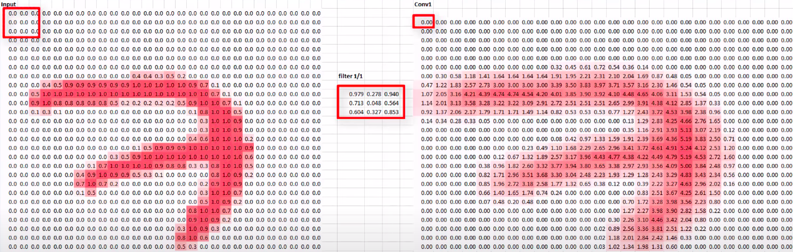
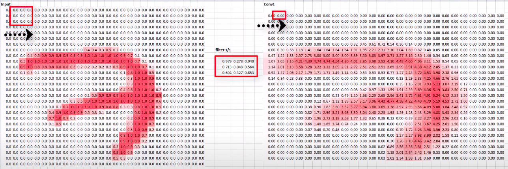
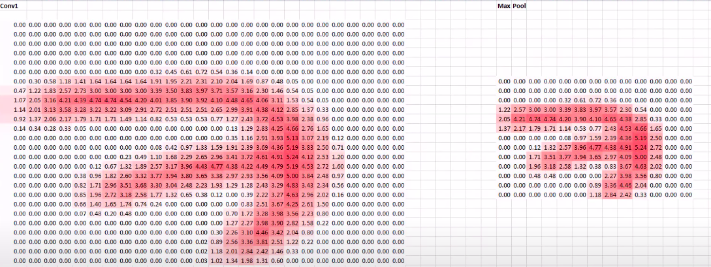

# AI Pool 2021 - Deep Learning - XRAI
```

                                           ..,,;;;;;;,,,,
                                     .,;'';;,..,;;;,,,,,.''';;,..
                                  ,,''                    '';;;;,;''
                                 ;'    ,;@@;'  ,@@;, @@, ';;;@@;,;';.
                                ''  ,;@@@@@'  ;@@@@; ''    ;;@@@@@;;;;
                                   ;;@@@@@;    '''     .,,;;;@@@@@@@;;;
                                  ;;@@@@@@;           , ';;;@@@@@@@@;;;.
                                   '';@@@@@,.  ,   .   ',;;;@@@@@@;;;;;;
                                      .   '';;;;;;;;;,;;;;@@@@@;;' ,.:;'
                                        ''..,,     ''''    '  .,;'
                                             ''''''::''''''''
                                                                 ,;
                                {Module XRAI}                   .;;
                                                               ,;;;
                                --Far From Earth--           ,;;;;:
                                                          ,;@@   .;
                                                         ;;@@'  ,;
                                                         ';;, ,;'        [17/03/2020]
```

---
Cette journée va être chargée chère équipe technique.
À force de vivre sous terre, de nombreux civils rencontrent des problèmes respiratoires.
Il s'avère que pour certains patients, c'est un cas de pneumonie. C'est une maladie grave et vu le nombre de patients nos médecins n'ont pas le temps d'analyser les résultats de chaque patient.

Heureusement avec le nouveau framework que l'équipe scientifique vous a présenté, vous êtes aptes à fournir une solution pour aider nos médecins.

Utilisez la librairie _Pytorch_ pour créer un modèle identifiant les cas de pneumonie depuis des photos X-Ray.

Contrairement à la démonstration faite par l'équipe scientifique, vous devrez charger vous-même le dataset.
Pour cela l'équipe scientifique vous fournit un outil qui vous sera utile: _h5py_

Pour maximiser l'efficacité de votre modèle, l'équipe scientifique vous invite à implémenter des Convolutions et du Pooling dans votre réseau de neurones.
N'ayez crainte, ils vous ont fourni un manuel sur les réseaux de neurones par convolution.

## Manuel Convolutional Neural Network

 L'objectif des convolutions est d'apprendre à détecter des motifs spécifiques dans une image.
 Par exemple détecter les yeux sur des portraits, ou encore le museau d'un chien, etc.

 Pour cela on applique un filtre à l'image donnée en entrée, ce filtre est notre convolution.
 Voyez le filtre comme une simple matrice ou l'on choisit le nombre de lignes et colonnes.
 L'utilisateur est libre de choisir le nombre de filtres par convolution.

 Prenons en exemple un filtre de taille 3\*3 :

 Quand le Layer de convolution recevra une image en entrée, il appliquera son filtre à chaque ensemble de 3\*3 pixels.
 Pour chaque ensemble de 3\*3 pixels le résultat sera le produit scalaire du filtre et de l'ensemble de pixels.
 
 
 Le résultat final deviendra alors l'entrée du prochain Layer qui répètra le même procédé.


Et le pooling dans tout ça ?

L'opération de pooling s'effectue typiquement après chaque Layer convolutif.
Il permet de réduire le coût de calcul et d'éviter l'overfiting en réduisant les dimensions des données d'entrée.

Pour cela on définit la taille du filtre (dans ce exemple 2\*2) ainsi que le stride (le pas), qui représente de combien de pixels notre filtre va se déplacer après chaque opération (dans cet exemple 2).

Le filtre prendra donc en entrée un ensemble de 2\*2 pixels (qui correspond à sa taille) et donnera en sortie la valeur maximale présente dans cet ensemble de pixels.
Par exemple pour une matrice contenant `[[0, 1.9], [3.2, 1.6]]` le résultat sera `3.2`.


Les convolutions combinées au pooling seront très utiles pour accomplir votre mission.
En ajoutant des couches de convolution avant vos couches denses, l'information reçue par vos couches denses sera bien plus ciblée, et potentiellement plus précise.

## Consignes:

- Sauvegardez le dataset dans un fichier `.hdf5`
- Construisez un modèle permettant d'identifier les patients atteinds d'une pneumonie avec une accuracy (précision) minimale de 75%.
- Affichez un graphe de l'évolution de votre loss.
- Afficher un graphe de l'évolution de votre accuracy.

Une fois cela fait, enregistrez votre travail dans le dossier `submit/` et envoyez-le.

## Useful links:
- Dataset : https://www.kaggle.com/paultimothymooney/chest-xray-pneumonia
- Convolutional Neural Networks (CNNs) explained : https://www.youtube.com/watch?v=YRhxdVk_sIs
- Max Pooling in Convolutional Neural Networks explained : https://www.youtube.com/watch?v=ZjM_XQa5s6s
- h5py : https://www.h5py.org
