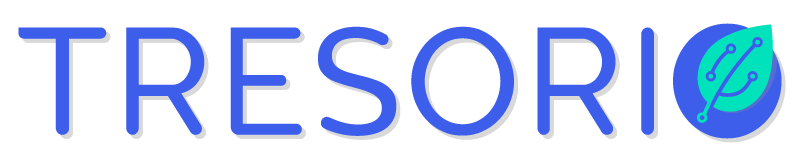

```
    ____    __  __   _____    __  __
   / __ \  / / / /  / ___/   / / / /
  / /_/ / / / / /   \__ \   / /_/ /
 / _, _/ / /_/ /   ___/ /  / __  /
/_/ |_|  \____/   /____/  /_/ /_/
```

---


Félicitations ! Nous voilà sauvés. La Terre reprend des couleurs et la vie va enfin pouvoir reprendre son cours. Pour fêter votre réussite, nous avons décidé d'organiser une exposition universelle exceptionnelle ! Nous vous mettons ainsi au défi de réaliser un projet en IA dans le domaine que vous souhaitez.
Vous pourrez choisir entre *NLP*, *Reinforcement Learning*, *Computer Vision*, ou *Deep Learning*. Cependent si vous désirez explorer un autre domaine libre à vous. Impressionnez-nous !

Voici quelques consignes :

- Nous allons vous proposer *3 sujets* avec un niveau de difficulté croissant. Durant la semaine vous avez écrit une grande quantité de code sur tous vos exercices, et vous pourez bien entendu réutiliser ce code, y compris celui des corrections, ou même du code trouvé sur Internet. Vous n'avez aucune limite imposée sur votre code.

- Vous devez réaliser ce projet en groupe (minimum 2 personnes)

- Nous allons vous transmettre des ressources pour vous aider à avancer sur le projet que vous avez choisi, si vous avez choisi un de nos sujets conseillés.

- Vous avez jusqu'à dimanche matin (10H) pour rendre votre projet.

- Vous avez accès à des GPU récents et très performants fournis par notre partenaire *Trésorio*. N'hésitez pas à y demander accès si votre PC est trop lent ou si vore IA nécessite beaucoup de puissance.
---

---

---

# Voici la liste des projets :


1 - ARCADE GAME (*Reinforcement Learning*) :  Vous devrez choisir un environnement *gym* parmi [cette liste](https://github.com/cshenton/atari-leaderboard), et tenter de créer une IA capable de faire le score maximum possible sur le jeu choisi.
> Source :  https://www.youtube.com/watch?v=TPPPBeDRHj8&list=PLpEPgC7cUJ4YPZlfUu0vQTwPraVKPASUa&index=9
---

---

2 - STARCRAFT II (*Reinforcement Learning*) : Vous devrez créer une IA capable de résoudre le niveau 1 du célèbre jeu vidéo *Starcraft II*. L'environnement du jeu a été partagé et réalisé par l'équipe *Deep Mind* de chez Google, en partenariat avec *Blizzard Entertainment*.
> Source (*environnent*) : https://towardsdatascience.com/create-a-customized-gym-environment-for-star-craft-2-8558d301131f
>
> Source (*reinforcement*) : https://www.youtube.com/playlist?list=PLpEPgC7cUJ4asYeJjii7jwMCr2tqvnFVa
---

---

3 - VAN GauGan (Van Gogh ?) (*Computer Vision*) : Vous apprendrez à utiliser les célèbres GAN (*Generative Adversarial Network*), des réseaux de neurones extrêmement puissants (dangereux ?), qui sont notamment utilisés pour réaliser des *Deep Fake* sur des personnalités publiques. Votre objectif sera de créer grâce à ces réseaux de neurones des visages de personnes qui n'ont jamais existé !
> Source : https://pytorch.org/tutorials/beginner/dcgan_faces_tutorial.html.
> 
> Source (Projet PoC) : https://github.com/PoCInnovation/VanGaugan
---

---
