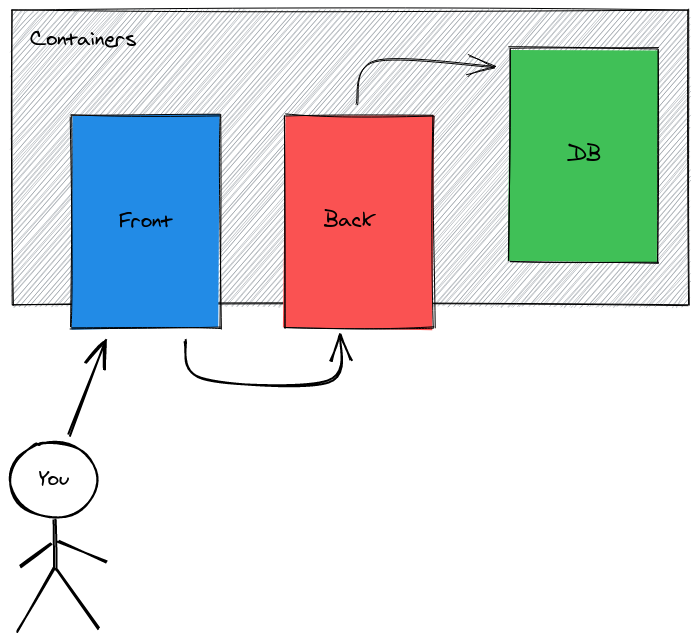

# Piscine Software - Jour 4 - Partie 1

✔ Apprendre les bases de Docker

✔ Orchestrer des conteneurs

✔ Comprendre l'intérêt du devOps

✔ Créer des images simples

## Exercice 00 - Setup

Tout d'abord, il vous faut installer Docker et ses dépendances :
 - [docker-ce](https://docs.docker.com/engine/install/fedora/) : L'édition communautaire de Docker
 - [docker-compose](https://docs.docker.com/compose/install/) : Un tool complémentaire vous permettant de gérer plusieurs containers à la fois très simplement

### Installation

:warning: Les étapes d'installation décrites ci-dessous sont faites pour fedora (votre dump de base). Si vous êtes sur une autre distribution, voici un [lien](https://docs.docker.com/engine/install/)

Désinstaller les paquets inutiles :

#### Cleanup

```shell
sudo dnf remove docker                   \
                docker-client            \
                docker-client-latest     \
                docker-common            \
                docker-latest            \
                docker-latest-logrotate  \
                docker-logrotate         \
                docker-selinux           \
                docker-engine-selinux    \
                docker-engine
```

#### Installation

Ensuite, installer `docker-ce` :

```shell
# Ajouter le repo docker
sudo dnf -y install dnf-plugin-core
sudo dnf config-manager --add-repo https://download.docker.com/linux/fedora/docker-ce.repo

# Installer docker
sudo dnf install docker-ce docker-ce-cli containerd.io
```

Installer `docker-compose` :

```shell
sudo curl -L "https://github.com/docker/compose/releases/download/1.25.5/docker-compose-$(uname -s)-$(uname -m)" -o /usr/local/bin/docker-compose
sudo chmod +x /usr/local/bin/docker-compose
```

#### Activer Docker

Une fois l'installation complétée, activez le service avec la commande `sudo systemctl start docker`.

:bulb: Vous pouvez l'activer de façon permanente avec la commande `sudo systemctl enable docker`.

> Pour le moment, vous serez obligé d'utiliser les commandes Docker avec `sudo`, il existe une façon de régler ce problème mais il faut redémarrer. Vous pourrez le faire plus tard si vous le souhaitez.

:warning: Fedora 31+

Si vous êtes sur Fedora 31, vous allez probablement voir l'erreur suivante :

```shell
docker: Error response from daemon: cgroups: cannot found cgroup mount destination: unknown.
```

Suivez la solution sur ce [lien](https://github.com/docker/for-linux/issues/219), attention, vous devrez exécuter ce script à chaque reboot.

#### Hello World

Exécuter la commande `sudo docker run hello-world`.

Si tout se passe bien, vous devriez obtenir le résultat suivant

```shell
Hello from Docker!
This message shows that your installation appears to be working correctly.
```

Vous êtes fin prêt pour cette initiation à Docker !

#### Ressources
- [Installer Docker](https://docs.docker.com/get-docker/)
- [Installer Docker-compose](https://docs.docker.com/compose/install/)

## Exercice 01 - Simple conteneur

Les Dockerfiles forment la base pour conteneuriser votre application. L'idée est de créer une image de votre application de façon à pouvoir la déployer très facilement.
Cela vous évite par exemple d'installer l'application directement sur votre pc ou encore d'avoir des soucis de dépendances non installées. Avec une image, aucun problème, tout est installé dans celle-ci et vous n'avez plus qu'à lancer la commande `docker run <votre image>` pour lancer l'application.

L'objectif est de créer une image docker issue de l'API que vous avez faite au jour 2.

Copiez-collez vos sources dans le dossier `exo1` puis ajouter un fichier `Dockerfile`

Votre dockerfile doit :
 - Être basé sur la dernière image `alpine` de node.
 - Exposer le port 8080
 - Installer les dépendances npm
 - Set la variable d'env `HELLO_MESSAGE` à `docker`
 - Build l'application
 - Au lancement de l'image, l'API doit se lancer directement

> :warning: Demandez-vous quel doit être l'host de votre API.

> Le keyword `alpine` sur une image précise que celle-ci est allégée, seule le nécessaire est dans celle-ci.
> Par exemple, les images alpines ont comme gestionnaire de paquets `apk` et non `apt`.

Une fois l'image lancée, vous devriez pouvoir accéder à votre application.

**Rendu :** `exo1/`

#### Ressources
- [Dockerfile](https://docs.docker.com/develop/develop-images/dockerfile_best-practices/)
- [Référence](https://docs.docker.com/engine/reference/builder/)

## Exercice 02 - Composer

Vous avez vu comment Dockeriser une application, il est temps de passer à la vitesse supérieure ! Vous allez maintenant gérer plusieurs conteneurs.

L'objectif est de dockeriser cet ensemble d'applications.

Les [sources](https://github.com/PoCInnovation/Pool2021/tree/master/Software/day04/resources/part1-exo02) sont composées de :
 - Une base de données postgres (à lancer dans un container)
 - Une API en Nestjs
 - Une webapp en React

À l'issue de cet exercice, vous devrez obtenir le résultat suivant :



Pour cela, vous devrez réaliser :
 - Un Dockerfile pour votre Backend
 - Un Dockerfile pour votre Frontend
 - Un docker-compose pour relier le tout

Le [docker-compose](https://docs.docker.com/compose/) vous permet d'orchestrer simultanément différents services (conteneur). Cela vous simplifie énormément la tâche lorsqu'il s'agit de déployer plusieurs micro-services.

Votre docker-compose doit avoir :
- **3** services :
  - backend
  - frontend
  - database
- **1** network :
  - backend
- **1** volume :
  - db-data

:warning: Faites attention à vos hosts

> :bulb: **Tips**
> - Vous pouvez set un environnement dans votre docker-compose
> - Vous pouvez build un Dockerfile directement dans votre docker-compose

**Rendu :** `exo2/`

#### Ressources
- [Docker-compose](https://docs.docker.com/compose/)
- [Reference](https://docs.docker.com/compose/compose-file/)

## Ressources complémentaires
- [Kubernetes, le boss final](https://kubernetes.io/)
- [DockerSwarm, le marécage de Docker](https://docs.docker.com/engine/swarm/)
- [Déployé en toute simplicité avec Helm](https://helm.sh/)
- [La GUI des containers](https://github.com/jesseduffield/lazydocker)
- [Les meilleures tools devOps de 2020](https://medium.com/better-programming/must-learn-devops-tools-for-2020-1a8a2675e88f)
- [L'infrastructure in Code avec Terraform](https://registry.terraform.io/providers/kreuzwerker/docker/latest/docs)

> PoC - 2021
